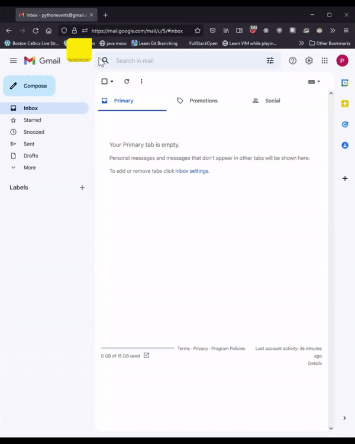

## PythonEvents

This is a submission for the OSU Hackathon Fall 2022. 

## Table of contents

- [Python Events](#python-events)
  - [Table of contents](#table-of-contents)
  - [Overview](#overview)
    - [Screenshots](#screenshots)
    
  - [Our Process](#our-process)
    - [Built with](#built-with)
    - [Lessons Learned](#lessons-learned)
    - [Continued development](#continued-development)
    - [Usefull resources](#usefull-resources)
   
   - [Authors](#authors)

## Overview
Oregon State University(OSU) Hackathon club put togeather "Beaver Hacks Fall 2022." The event was set up to help students learn new skills, build cool stuff, and compete for prizes. Our team concisted of two new students to the OSU Computer Science post bacc program and competed in the new student catagory. The prompt of the Hackathon was "Life Hacks" and the goal was to build a program that fits this prompt in three days. 

## Screenshots

## Our Process

## Built With
- requests library to access the seatgeek api
- smtplib library to send emails using the smtp protacol 
- os and dotenv librarys to store api credentials in an .env file
- datetime and time librarys
- jinja2 

## Lessons Learned
- How to make simple API requests
- Sending email from a python program 
- Basic HTML formatting
- Using Git and Github in a team enviornment
-
## Continued development

## Usefull resources

## Authors

